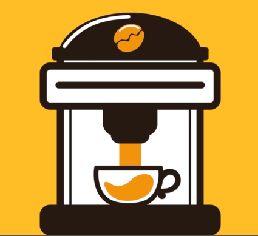
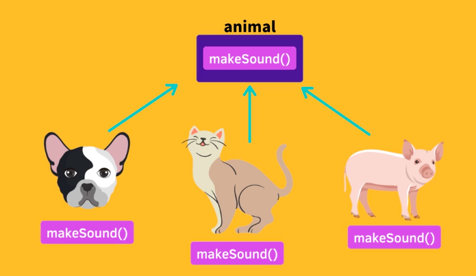

# Chapter4. 객체지향

## 절차지향적 vs 객체지향적

 

> ### 1. 절차지향적 프로그래밍 (Imperative and Procedural Programming)

 

(https://academy.dream-coding.com/courses/take/typescript)

 

### 특징

- 명령과 절차를 따라가는 프로그래밍
- 메인 함수를 호출하고 그 속에서 여러가지 함수를 호출
- 정의된 순서대로 호출하는 프로그래밍 방법

 

### 단점

- 프로젝트에 중간에 들어온 사람은 한 가지 수정을 하려면 프로젝트 전체 코드를 이해해야함
- 한 부분을 수정했을 때 사이드 이펙트 발생 확률이 높다
- App을 한 눈에 이해하기 어렵기 때문에 **_유지보수 어려움_**, **_확장 어려움_**

 

> ### 2. 객체지향적 프로그래밍 (Object Oriented Project)

 

(https://academy.dream-coding.com/courses/take/typescript)

 

### 특징

- 데이터와 함수를 포함한 객체를 하나의 unit으로 본다
- 각 unit을 연결하여 프로그래밍
- 문제가 있을 때는 해당 obj만 수정하면되기 때문에 **_유지보수하기 좋다_**
- 새로운 내용 추가할 때는 독립적인 obj를 하나 추가하면 되기 때문에 **_확장성이 좋다_**
- error, event, exception 등을 obj로 묶어서 사용

 
 

## 객체 지향의 4 원칙

 

### 1. 캡슐화 ( Encapsulation )

 

(https://academy.dream-coding.com/courses/take/typescript)

 

### 포인트 🧶 🧶

- 관련있는 데이터와 함수를 하나의 obj로 묶는 것
- 어떤 데이터를 보여줄 것이고, 어떤 것은 보여주지 않을 것인지 생각하는 것
- obj를 사용하는 외부에서 보일 필요가 없는 데이터를 잘 숨겨두는 것이 관건

 
 

### 예시 🧶 🧶

- 고양이의 기쁨, 배고픔 등을 우리가 결정해 줄 수는 없다. (외부에서 접근하지 못하는 내용)
- 하지만 우리가 놀아주거나 먹이를 줌으로써 기분을 바꾸어줄 수있다. (함수를 이용)

|  |  |
| ------------------------------------------------------- | --------------------------------------------------------- |

 
 

### 2. 추상화 ( Abstraction )

 

(https://academy.dream-coding.com/courses/take/typescript)

 

### 포인트 ☕️ ☕️

- 유저는 내부의 기능과 로직을 이해할 필요가 없이 제공되는 API를 사용하면 된다.

 

### 예시 🧶 🧶

- 커피 머신이 어떻게 작동하는지 몰라도 버튼으로 커피를 내릴 수 있다.
- 어떤 데이터와 내부로직이 있는지 몰라도 제공되는 함수만 쓰면 필요한 것을 얻을 수 있다.

|  |  |
| ---------------------------------------------------- | ------------------------------------------------------ |

 
 

### 3. 상속 ( Inheritance )

 

(https://academy.dream-coding.com/courses/take/typescript)

 

### 포인트 🦋

- 잘 정의된 부모 클래스를 이용하면 약간의 추가로 자식 클래스를 쉽게 구현할 수 있다.

 

### 예시

- HTMLElement는 EventTagrget > Node > Element 순으로 상속된 클래스이다.
- 그래서 HTMLElement들은 EventTarget이 제공하는 이벤트들을 사용할 수 있는 것.

(https://academy.dream-coding.com/courses/take/typescript)

 
 

### 3. 다형성 ( Polymorphism )

 

(https://academy.dream-coding.com/courses/take/typescript)

 

### 포인트 🦋

- 같은 부모를 두고 있는 자식들은 공통의 함수로 호출 할 수 있다?

 

### 예시

- 동물의 하위 클래스는 makeSound() 가능
- 커피머신의 하위 클래스는 모두 shot() 가능

|  |  |
| ------------------------------------------------- | ---------------------------------------------------- |
